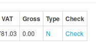

+++
title = "Missing Bill Elements That Aren't Missing"
date = 2019-11-09T10:38:00Z
template = "blog_post.html"
+++

TL;DR The bill check no longer says that bills are missing when they're not.

A Chellow user (we'll call them Jem) said to me, 'When I run the bill check it
says that some bills are missing when they aren't'.

Some background: when a bill check is run, you get back a report of the
differences between the actual bill (received from the supplier) and the
virtual bill (created by Chellow). You also get a list of missing bill
elements, for example, say the virtual bill has the element `duos-fixed-gbp`,
but the actual bill doesn't, then the report will say that the `duos-fixed-gbp`
bill is missing.

So Jem was checking a single
[TRIAD](https://en.wikipedia.org/wiki/Electricity_billing_in_the_UK#Transmission_charges) bill that spanned an entire year. (It would have been so much easier
if the supplier had just made it span March, but then we have to deal with
whatever's thrown at us.) So Jem's bill only had TRIAD charges in, but all the
other bills for that supply were present and correct, so the bill check
should have given a clean bill of health, but in fact it was saying that some
bills were missing. This kind of false positive was really annoying for Jem
because it meant that they had to check for something that wasn't actually a
problem.

To solve the problem we've had to make Chellow generate bills at the
half-hourly level. That is to say, each half-hour has it's own virtual bill.
That way we can accurately say if there are any missing bills. It was quite a
big undertaking, but well worth it.
