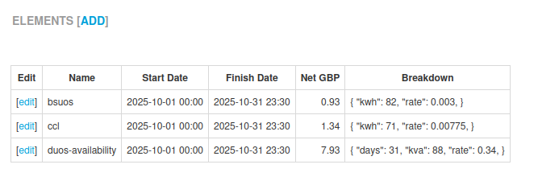

+++
title = "Element-Level Billing"
date = 2025-10-09T00:00:00Z
+++

An electricity bill is made up of many individual elements, each with a cost attached to
them. Some examples of elements are:

* ccl (Climate change levy)
* eii (Energy intensive industry support payments)
* duos-availability (Distribution cost based on size of connection)
* duos-red (Distribution cost based on peak time consumption)
* bsuos (Balacing System charge)
* ...and so on

Up to now, Chellow stored these elements and their associated backing data as a field in
the bill. From now on, Chellow separates out each element and gives it its own row. So that
a bill has several elements attached to it. Each element contains:

* Name
* Net GBP
* Start Date
* Finish Date
* Breakdown (containing the supporting data such as rate, kWh etc.

Here's an examlple of the *elements* section of the bill page:

One advantage of doing this is that we can properly represent a single bill that has
elements that are for different periods to the period of the bill. Another advantage is that
it gives added clarity in bill checking.
