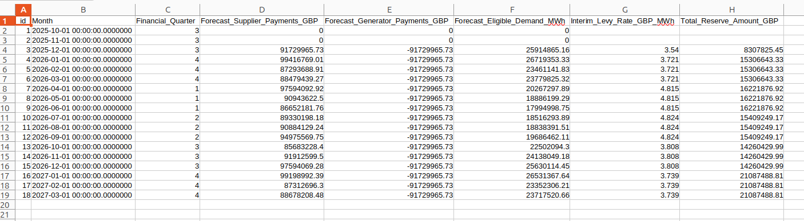

+++
title = "Forecasting RAB costs appearing in December"
date = 2025-10-11T00:00:00Z
+++

The RAB charge is a subsidy for nuclear generation that will appear as a separate item in
bills for those with a pass-through contract. The first RAB charges will appear in bills
for December's consumption. There are essentially two parts to the charges, Interim and
Operational. This post focuses on forecasting the Interim element from published forecasts.

I was pleased to see that the LCCC publish a feed of forecast interim RAB rates via an API. Chellow has a process that automatically checks the LCCC data portal every so often and
updates feeds for CfD, and so it was relatively easy to add some code that also downloads
the RAB forecast. I used the JSON format because its a bit easier to process
programmatically, but here's the data in CSV format:

The key bits of info for us are the *Month* column and the *Interim_Levy_Rate_GBP_Mwh*. I
programmed Chellow to calculate for each month:

    RAB Interim GBP = Interim_Levy_Rate_GBP_Mwh / 1000 x (kWh in NBP)

A couple of things to note:

* The rate is divided by 1000 because it's in MWh, and we're working in kWh.
* The kWh is at NBP (Notional Balancing Point), which takes into account transmission and distribution losses.

Finally, we run the virtual bill in Chellow for the future and see what we may need to pay
in the coming months and years.
