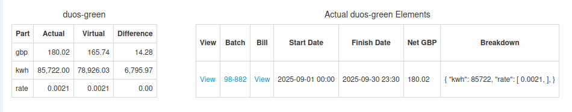

+++
title = "Finding DNO Tariffs"
date = 2025-10-18T00:00:00Z
template = "blog_post.html"
+++

In a pass-through electricity contract, one of the things that is often passed through are
the Distribution Use of System (DUoS) charges from the Distribution Network Operators
([DNOs](https://en.wikipedia.org/wiki/Distribution_network_operator). The DNOs publish
their tariffs in an MS-Excel spreadsheet, which they put on their website. An example is
[SSE's charging statement for 24/25](https://www.ssen.co.uk/globalassets/library/charging-statements-sepd/202526/sepd---schedule-of-charges-and-other-tables---april-2025-v0.3.xlsx).

As a developer working on the [Chellow](https://www.chellow.org/) bill validation system,
I need to make sure that all the correct DNO tariffs are held in Chellow so that we can
check that the DNO charges in each bill are correct. Here's a screenshot from Chellow
showing a bill check for DUoS Green:

The table on the left shows that we've been overcharged by £14.28, and that the rate was
correct, but the error was in the kWh. Chellow gets the virtual rate from its database of
DUoS rates, which comes from the DNO's spreadsheets.

One brilliant thing about the DNO's spreadsheets is that even though they're produced by
all the different DNOs, they're all in the same format, which makes parsing them a lot
easier. A problem though, is that it's difficult to automate finding and downloading the
spreadsheets, as they're scattered over the web. So what we've done is manually maintain a
repository of DNO spreadsheets at:

[https://github.com/WessexWater/chellow-rates](https://github.com/WessexWater/chellow-rates)

This is freely available for anyone to use. You click on the year you're interested in,
then <code>electricity</code> -> <code>duos</code> -> and the DNO code, and then you should
find the DNO spreadsheet, which you can download with the <code>Download Raw File</code>
button. If the DNO you need isn't there, just let me know and I'll add it in.

While adding the DNO spreadsheets to the repository is a manual process, it only has to be
done once, and then each instance of Chellow can automatically import the spreadsheets
using the [GitHub API](https://docs.github.com/en/rest). The API is free to use, so you're
welcome to use it to automatically update your system's DNO rates. 
