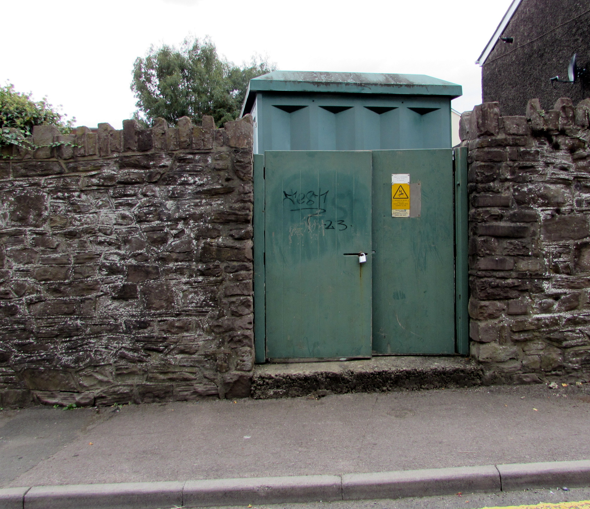
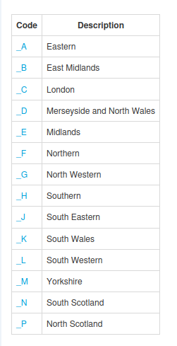
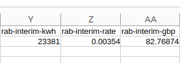

+++
title = "Calculating kWh at NBP"
date = 2025-10-25T00:00:00Z
template = "blog_post.html"
+++

Before we get into NBP kWh, there's an update on the [previous post](/blog/2025-10-18/) on
finding DNO tariffs. I've heard from the industry body [DCUSA](https://www.dcusa.co.uk/)
that they're working on an API for DNO tariffs, which is great news. They caution that it's
still in the early stages of development though.

So, on to NBP. Many electricity tariffs are charged at NBP, for example the RAB charge I've [talked about previously](/blog/2025-10-11/). With the RAB interim charge, the cost is
calculated as:

`(RAB Interim Charge £) = (Rab Rate) x (NBP kWh)`

MSP (Meter Supply Point) kWh is the amount of electricity measured at the meter. The kWh
you see in the half-hourly data collected from the meter is at MSP. Before getting to the
meter, the electricity has to go through the transmission and distribution networks.
Transmission refers to the national grid:

and distribution refers to the local DNO network:

NBP kWh is the amount of electricity before transmission and distribution losses occur. The amount of electricity before distribution losses is known as Grid Supply Point (GSP) kWh:

`GSP kWh = MSP kWh * LAF`

where the LAF is the Loss Adjustment Factor. NBP kWh is:

`NBP kWh = GSP kWh x TLM`

where TLM is the Transmission Loss Multiple. We'll concentrate on the TLM, which takes us
from GSP to NBP. There's a different TLM for each half-hour, and for each region of the
country. As a programmer working on Chellow, I'm pleased that Elexon makes the TLM data
available for automatic download [via their portal](https://www.elexonportal.co.uk/). The
regions of the country are known as GSP Groups, and every electricity supply is within a
GSP Group. Here's a screenshot from Chellow showing the GSP Groups:

Then if we run a virtual bill in Chellow, it would do the calculations for each half-hour
and give us the following example result:

I've used RAB Interim as an example here, but the same principle applies to any element
that's billed at NBP kWh.

Hope you enjoyed this post, and see you next time! 
