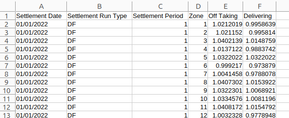

+++
title = "Reconciliations and NBP kWh"
date = 2025-11-01T00:00:00Z
template = "blog_post.html"
+++

If you have a complex pass-through tariff, you'll notice that after the initial charge for
an element, you'll often get one or more subsequent charges. These subsequent charges can
even arrive months after the contract has ended, which prompts questions from the business.
It's our job to make sure that the total billed amount is correct, and this post discusses
this in the context of our old friend the TLM (Transmission Loss Multiplier). In a
[previous post](/blog/2025-10-11/) I discussed the forthcoming RAB charge, which is billed
at NBP kWh. Some other pass-through charges calculated at NBP kW are:

* Elexon Charge
* EII (Energy Intensive Industries)
* CM (Capacity Market)
* BSUoS (Balancing System)
* CfD (Contracts for Difference)

I talked before about [how to calculate NBP kWh](/blog/2025-10-25/), but let's now dive
deeper into TLMs. I'm a programmer working on [Chellow](https://www.chellow.org/), and
here's a screenshot of the TLMs file being downloaded into its database:

You can see the URL of the TLM file, with my scripting key blurred out. It's free to
register for the [Elexon Portal](https://www.elexonportal.co.uk/) and then you get a
scripting key that's unique to you. Here's what the TLM file looks like:

The *Settlement Date* and *Settlement Period* tell you the half-hour that the TLM is for,
the *Zone* maps to the GSP Group and the bit we're going to focus on is the
*Settlement Run Type*. The run is the version of the data, with later runs being issued as
the data becomes more accurate. The runs are:

<dl>
  <dt>II</dt>
  <dd>1 Week</dd>
  <dt>SF</dt>
  <dd>1 Month</dd>
  <dt>R1</dt>
  <dd>2 Months</dd>
  <dt>R2</dt>
  <dd>4 Months</dd>
  <dt>R3</dt>
  <dd>7 Months</dd>
  <dt>RF</dt>
  <dd>14 Months</dd>
  <dt>DF</dt>
  <dd>28 Months</dd>
</dl>

So for example if a TLM is labelled SF, it means that it was issued one month after the
date that the TLM was for. You can see where the reconciliations come from now. Say the
supplier produced the first bill before SF, then when SF occurs the charges passed through
to the Supplier may have changed, and they may change again in the future, which can result
in the supplier issuing reconciliations to the customer.

Where does that leave us as bill validators? Firstly we need to be able to model this, so
that as soon as a new run comes out we should tell the business the impact this will have
on the bills and include it in the accrual. Then, when a reconciliation arrives we need to
check that it's accurate. Also, we need to chase things up with the supplier if an expected
reconciliation doesn't arrive, especially if it's in our favour 🤑

Finally, in checking the bills, we need to know which settlement run the supplier used to
produce the bill. Unfortunately, in my experience, suppliers aren't good at doing this,
but I'd be interested to know what your experience is.

See you next time! ✨
