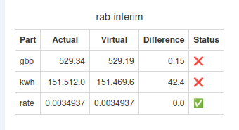

+++
title = "Calculating GSP kWh"
date = 2025-11-15T00:00:00Z
template = "blog_post.html"
+++

We've finished a run of posts on calculating kWh at NBP. As a reminder, electricity travels
through the transmission system, then through the distribution system and then ends up
being measured at the meter, MSP (Meter Supply Point). The transmission losses are known as
TLMs (Transmission Loss Multipliers) and the distribution losses are known as LAFs (Loss
Adjustment Factors). Here's the formula for NBP for every half-hour:

    (NBP kWh) = (GSP kWh) x TLM

In this article we'll be focussing on calculating the _GSP_ (Grid Supply Point) kWh, which
is the amount of electricity entering the distribution system:

    (GSP kWh) = (MSP kWh) x LAF

The LAFs are downloadable from the [Elexon Portal](https://www.elexonportal.co.uk/), and
they get downloaded every so often into Chellow:

You can see I've blurred out my scripting key in the URL, but it's free to get one. You'll
also notice that you need to specify the Participant Code of the DNO that you want to
download the LAFs for. In this case the code is SOUT, which is the code for DNO 20. A DNO
has many LLFCs (Line Loss Factor Classes) and every LLFC has a LAF for every half-hour.
Every supply has an LLFC. Let's have a look at the LAFs for DNO 20 and LLFC 033 in Chellow:

This tells us that if a supply with LLFC 033 has, say, 1 kWh of consumption at the meter
between 01:30 and 02:00 on 1st November 2025, the GSP consumption will be 1.074 kWh. When
we come to do a bill check in Chellow, it'll automatically calculate GSP kWh, for example
here's the bill check for the RAB Interim element of a bill, with NBP kWh (which involves
first finding GSP kWh):

See you next time! ✨
