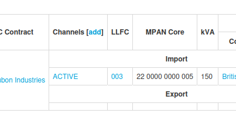

+++
title = "LLFCs"
date = 2025-11-22T00:00:00Z
template = "blog_post.html"
+++

In the [previous post](/blog/2025-11-15/) I mentioned that every electricity supply has a
Line Loss Factor Class (LLFC), which is a 3 character code that reflects the supply's
characteristics. Here's a screenshot from [Chellow](https://www.chellow.org/) showing a
supply with an import LLFC of 003. If the supply had export, then there'd be a separate
LLFC for the export side.

Each DNO has a set of LLFCs that they maintain, and in this example you can see from the
first two digits of the MPAN Core that the DNO is 22. Clicking on that LLFC 003 we get:

The description tells us that it's High Voltage and non-domestic. At the bottom there's a
link to the LAFs which we saw in the previous edition. With our LLFC in hand, we can use
it to look up several important things:

* The LAF for every half-hour, which let us calculate GSP kWh.
* The DNO tariff, which is the distribution part of a bill.
* The TNUoS charge, which is the standing charge for using the transmission system.

Let's look up the DNO tariff. We store the DNO tariff spreadsheets centrally in a
[GitHub repository](https://github.com/WessexWater/chellow-rates) from which you can use
the download button to get the spreadsheet you're interested in: 

Opening up the spreadsheet and having a look for 003, we can see the DNO charges:

That tells us for example that for this supply the DUoS (Distribution Use of System) charge
for the green period for LLFC 003 is 0.210 p/kWh, or 0.0021 £/kWh. To round things off, I
can't resist doing a bill check in Chellow to show this:

Phew, Chellow's using the right rate, and so is the supplier. In this case the kWh figures
don't match, which is why there's a difference in £, but that's the subject of another
article.

See you next time! ✨
