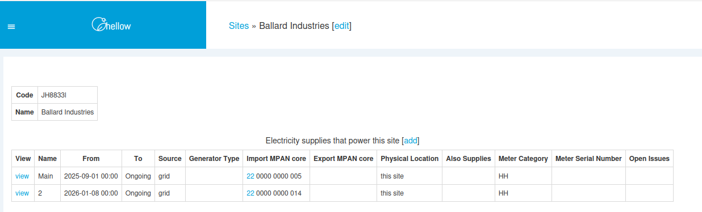
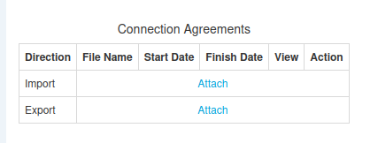
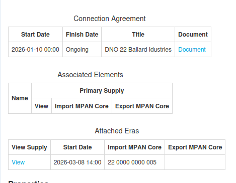
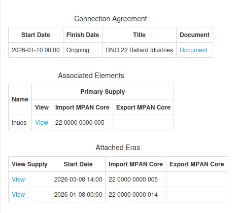

+++
title = "Associated MPANs"
date = 2026-03-08T00:00Z
template = "blog_post.html"
+++

A large site will often have multiple electricity supplies, each with their own MPAN. However, the
connection agreement with the DNO will group the MPANs together for charging certain elements.
These 'grouped together' MPANs are known as associated MPANs. For example, it may be that for a
group of associated MPANs, the TNUoS charge is only applied to one of the MPANs.

As a programmer of Chellow I have to make sure that when we calculate the virtual bill for these
supplies, it models the billing for associated MPANs correctly. We've settled on the solution of
having a connection agreement item in Chellow, to which multiple supplies can be attached, thus
associating them. Each connection agreement lists the billing elements that are associated, and to
which supply it should be billed.

Here's a screenshot from Chellow of two electricity bills on a site:

Let's say that these two are associated MPANs in the DNO connection agreement, and the TNUoS charge
only applies to supply 22 0000 0000 005. We can edit the era of the supply to attach a connection
agreement: 

Here's the resulting connection agreement page:

Notice that at this stage there's only one attached era and no associated elements. Adding the era
of the other supply, and adding an associated billing element gives us:

So now we've represented the billing arrangement in Chellow and the virtual bill should now be
correct, and we can compare it against the actual bill from the supplier to verify that we're being
billed correctly.

See you next time! ✨ 
