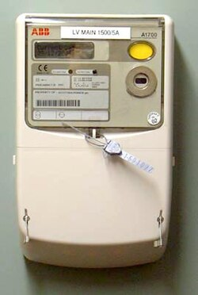
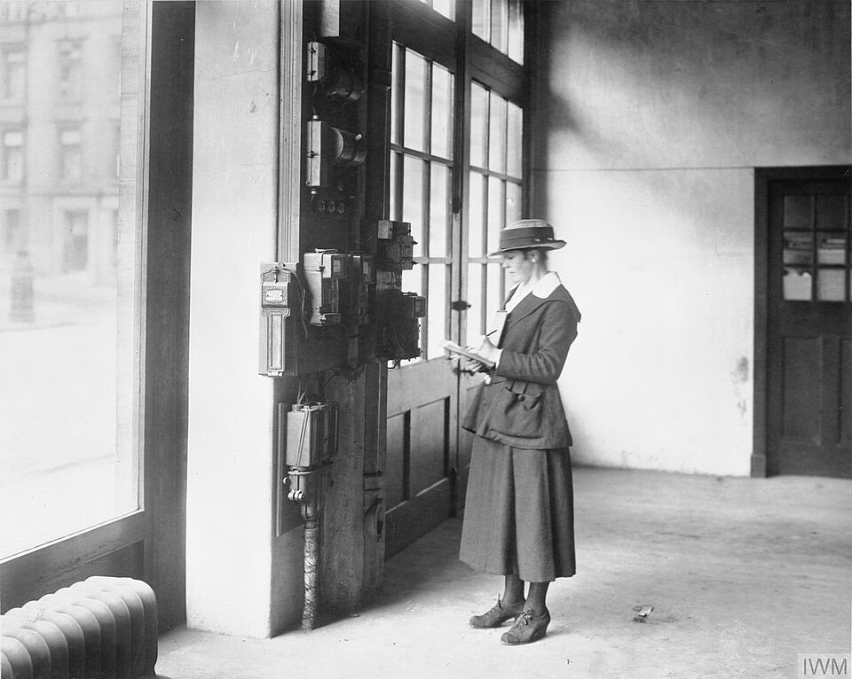

+++
title = "Electricity Accruals"
date = 2026-03-14T00:00Z
template = "blog_post.html"
+++

I expect that many of you, like me, will be involved with producing the electricity accrual each
month for Finance. The accrual is the cost of electricity that's been used, but not yet billed. For
Finance, the more accurate the accrual the better.

## Half-hourly Meters

For half-hourly metered supplies this is easy because the HH data is available the day after it is
recorded. So within the first couple of day of the month we can run the virtual bills on the HH data
and get a really accurate figure for the cost of the previous month.

## Heritage Meters

For heritage meters, Chellow projects forward the usage based on the most recent actual reads, and
then the virtual bill uses that projected consumption to calculated the total bill for the month.

## AMR Meters

For AMR meters the supplier bills on reads retrieved from the meter. As soon as the reads come in,
they're sent to the supplier and also made available to the customer. So that means Chellow can
download the latest AMR reads and use those for the accrual straight away, rather than having to
wait until they appear in the bills later on in the month.

## Other Parts of the Accrual

So far we've just concentrated on calculating the cost of energy used for the month just gone. Other
things affect the accrual though:

* Historical bills that we know are inaccurate, but haven't yet been re-billed.
* Historical missing or estimated data that then becomes available.
* Elements such as CfD that are reconciled at a future date.

These are handled in Chellow using the same method of running a virtual bill which contains the most
up-to-date view of what we'll eventually be billed. For example, Chellow will use the latest NBP kWh
figure, which we know before the reconciliation comes in from the supplier. How far you go back
depends on the particular situation, but at least a couple of years back seems sensible.

See you next time! ✨ 
