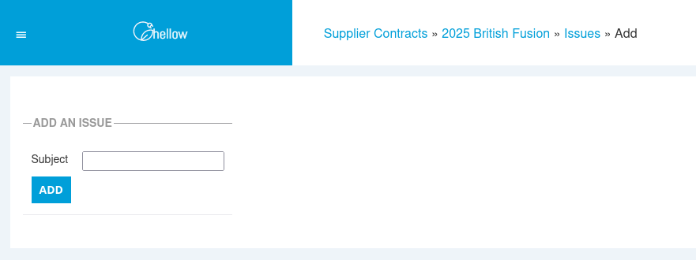
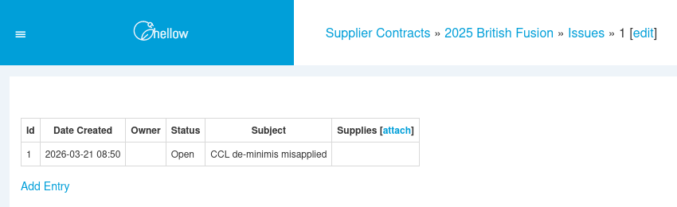
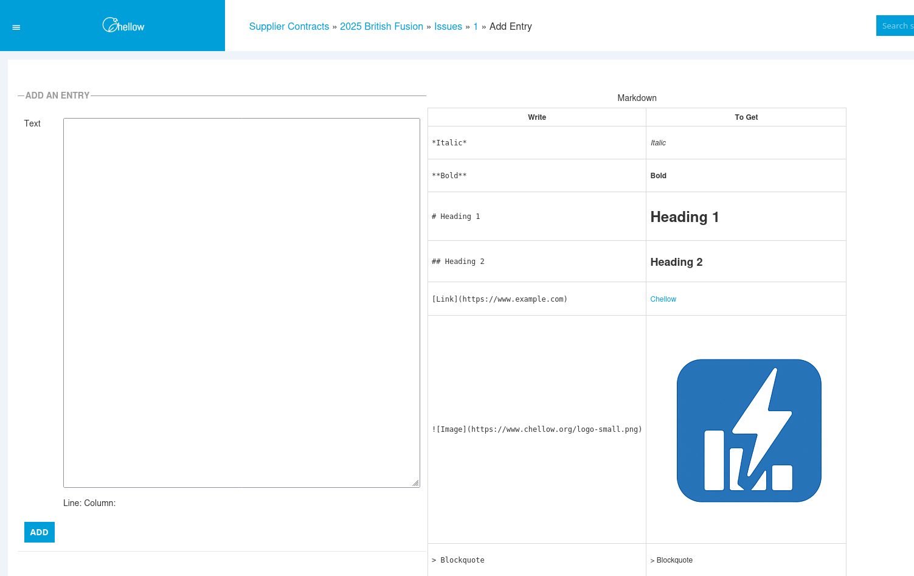
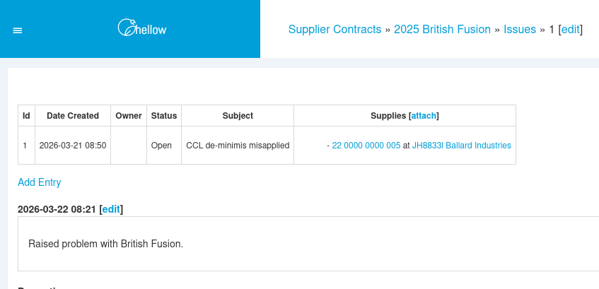

+++
title = "Issue Tracking"
date = 2026-03-22T00:00Z
template = "blog_post.html"
+++

As you go about validating energy bills, you come across various problems you want to log and then
go through ticking them off when they're resolved. It's nice to have a convenient list to send off
to suppliers and work through in supplier meetings.

Up to now in our team, each person did this in their own way, maybe using a spreadsheet or in my
case a hand-coded web page. Then Alistair in our team suggested we integrate issue tracking into
our billing system Chellow. It was a brilliant idea, and I'm sure other bill checking systems have
this built-in. I'd be interested to know from other people the good / bad points of the issue
tracking system that they use.

Say we had a supplier contract called 2025 British Fusion, then we can add an issue for it:

The idea is that every issue is always attached to exactly one contract, which provides an
organizing principle for manipulating issues. So once we've created our issue:

we can add timestamped entries to update our progress. Each entry is in Markdown format, so you can
include links, tables and other formatting if you want to:

Often an issue will relate to a particular supply, so this can be added to the issue. Here's the
issue with an entry added and a supply attached:

We haven't covered filtering, downloading, assigning users and setting the status, but hopefully
this gives a good overview of issues within Chellow.

See you next time! ✨
