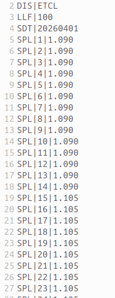
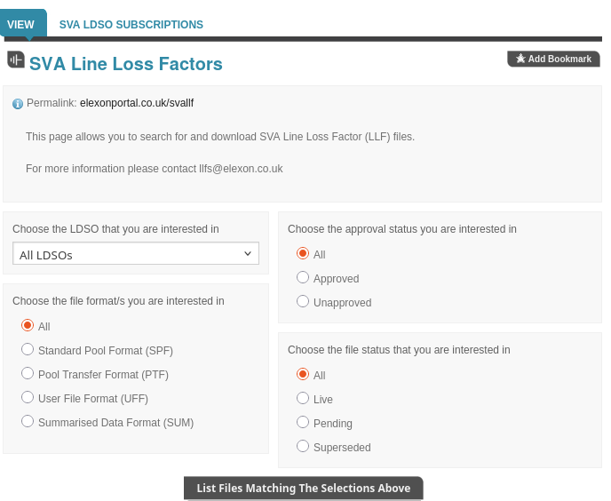

+++
title = "LAFs From Industry Standing Data"
date = 2026-03-28T00:00Z
template = "blog_post.html"
+++

In a [previous post](/blog/2025-11-15/) I talked about distribution losses, and using the LAF (Loss
Adjustment Factor) to find the GSP kWh from the MSP kWh:

    (GSP kWh) = (MSP kWh) x LAF

There's a published LAF for every half-hour for every LLFC for every DNO, which is an enormous
amount of data. Chellow used to try and import only the ones it needed, but that got too fiddly so
now we just import the whole lot. The LAF files from the Elexon Portal in the PTF format look like:

The LAF files can be retrieved from the [Elexon Portal](https://elexonportal.co.uk/) in two ways,
API and manual download. The API method is preferable because it can be automated, so that's
Chellow's primary method. The call to the API is of the form:

    https://downloads.elexonportal.co.uk/svallf/download?key=8jrjfglsjkjj&ldso=LDSO&format=SPF|PTF|UFF|SUM

The drawback is that you can only download the LAFs for the current financial year, but we want to
load all the available LAFs for future years for forecasting. So to get future years we turn to the
manual download page:

We manually download the files we need and then put them onto the Rate Server which all Chellow
instances then automatically download from.

That all works, but it always bothered me that there was a manual step. Looking at the [Industry
Standing Data](https://bscdocs.elexon.co.uk/guidance-notes/industry-standing-data) (which replaces
the [Market Domain Data](https://elexonportal.co.uk/mddviewer/view), I saw that it contains the
full set of LAFs.

I've made a start on getting Chellow to use the ISD, but it's still a work in progress. There's an
API where you can call:

    https://datastore.helix.elexon.co.uk/api/ISD

and it'll download the full set of data. My plan is to get Chellow to automatically check every few
days for a new version and then import the LAFs if a new version has come out. In time we'll use the
ISD to completely replace the Market Domain Data, and that'll be another step forward for
automation.

See you next time! ✨ 
