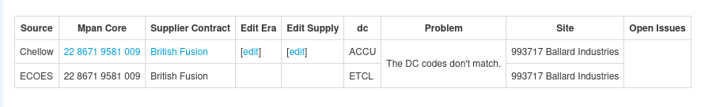
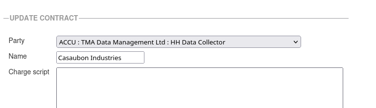
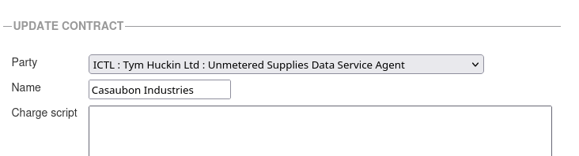

+++
title = "Market Roles Of A Data Collector"
date = 2026-04-06T00:00Z
template = "blog_post.html"
+++

The other day I ran what we call our Chellow vs ECOES report, which creates a list of discrepancies
between the characteristics of supplies held in Chellow and their characteristics in the industry
database [ECOES](https://www.ecoes.co.uk/). It's important that all discrepancies are investigated
to discover if ECOES or Chellow is wrong (or maybe both!), and once they're fixed we can be more
confident in bill checking and forecasting.

Here's a mock-up of a discrepancy it found:

You can see that Chellow has the DC as a party with participant code ACCU, but in ECOES it's ETCL.
Knowing the contracts in place for this fictional customer Ballard Industries (😄), the DC is
Tym Huckin, so ECOES is correct, so let's go to edit the contract:

But we want to set it to this:

An interesting thing that I've only just got to grips with is that a DC can have one of several
market roles. In the this case the ACCU one has the market role HH Data Collector, but the ICTL one
has the role Unmetered Supplies Data Service Agent. The same sort of thing happens with MOPs.

Anyway, having updated that contract, we re-run the Chellow versus ECOES report and that particular
discrepancy disappears, and so our bill validation and forecasting is correct, yay!

See you next time! ✨
