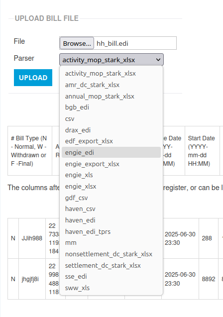

+++
title = "VTP Pass-through Charge"
date = 2026-04-18T00:00Z
template = "blog_post.html"
+++

The
[Virtual Trading Party](https://www.elexon.co.uk/bsc/market-entry/becoming-virtual-trading-party/)
(VTP) pass-through charge came to my attention this week, with the prospect of it appearing in the
next batch of bills that we receive. I'm still trying to understand the details, so if you have
anything to add or correct, then please let me know in the comments.

The things I'm fairly sure on are:

* It only applies to half-hourly metered supplies.
* It's charged at NBP kWh.
* The rate is the same across all supplies on the same contract.

I'm also assuming it'll be billed monthly, with an estimate and subsequent reconciliation. So as a
programmer of Chellow, I have two tasks:

* Change the bill parsers to recognize the VTP charge.
* Change virtual bills so that they include the VTP charge.

### Bill Parsers

In Chellow, a batch of bills is created, and then files can be uploaded to the batch, specifying a
parser:

These are the parsers that may need updating to parse the VTP charge correctly. What we'll get back
for each bill are the key bits of information:

* vtp-gbp (the total cost)
* vtp-rate
* vtp-kwh
* start-date
* finish-date

### Virtual Bill

My next task is to make sure the virtual bills for the HH contracts reflect VTP, which means reading
the rate from the supplier rates, applying the NBP kWh and finding the net cost for the particular
supply and period in question.

With the virtual bill done, we can now check bills as they come in, and also run forecasts to see
how the new charge will affect future costs.

See you next time! ✨
