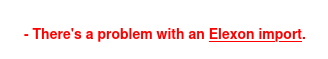
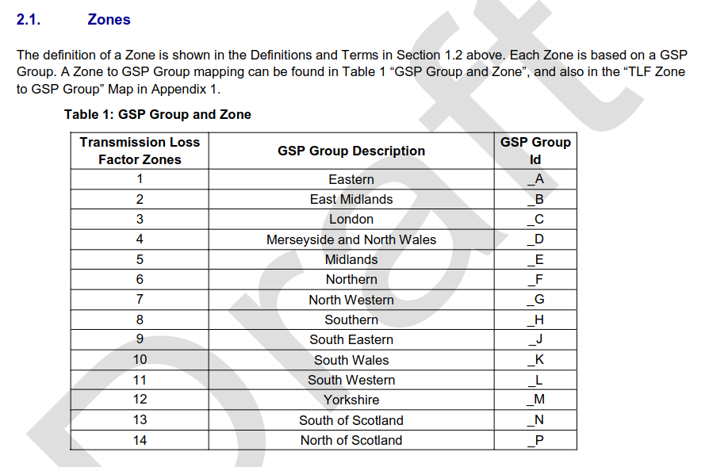

+++
title = "Elexon TLM File Glitch?"
date = 2026-04-25T00:00Z
template = "blog_post.html"
+++

On Thursday last week I saw a message on Chellow alerting me to a problem with the automatic imports
from Elexon:

There were two problems:

* The date format had changed.
* There were extra Transmission Loss Factor Zones in the file.

The date format went from UK style to ISO style, fair enough and ISO is a better choice. Now looking
at the [mapping between TLF Zones and GSP Groups](https://www.elexon.co.uk/bsc/documents/operations-settlement/transmission-losses/consultations/reference-network-mapping-statement-nms-supporting-document/):

That tells us the geographical area that the TLMs apply to. The problem is that zones 15 and 16 also
appeared in the file. AI is getting pretty good at electricity industry queries and Claude's opinion
was that it was a data error. ChatGPT thought that 15 was a special zone and 16 was a national
average used for interconnectors. I took the pragmatic step of just ignoring 15 and 16 because they
aren't needed for bill checking.

This all happened on Thursday / Friday last week, but checking yesterday, the file had reverted back
to its original format. If you know what happened, please do let me know in the comments.

### Side Note On AI

The way I use AI (for both writing like this and programming) is that I'm always the one typing each
character at the keyboard, and the AI is in a separate tab for various queries that I have. So I
don't do vibe-coding / writing where the AI types the characters. It's not that I've got any
objection to vibe-coding in principle, it's just that I feel like we're still at the stage where
humans have ultimate responsibility and so I probably need to understand everything I'm doing, and
the easiest way to ensure that is if I type it myself. I'm sure things will change as AI gets
better, but this is just a snapshot of how I'm working at the moment.

See you next time! ✨
