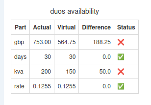
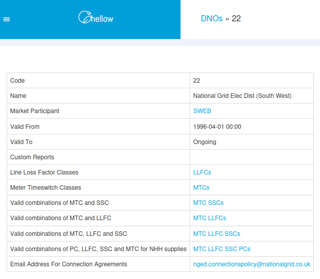
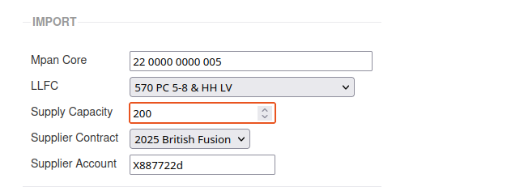
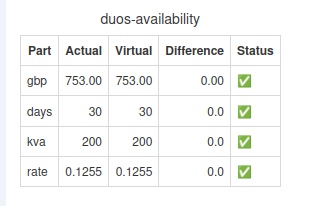

+++
title = "Getting a Connection Agreement Document"
date = 2026-05-04T00:00Z
template = "blog_post.html"
+++

Last week I ran a bill check on the latest batch of bills from a supplier, and the DUoS availability
charge was flagged up as a problem:

You can see that in the actual bill from the supplier, the size of the connection is 200 kVA, but in
Chellow we have it as 150 kVA. Which is correct? I had a look for the connection agreement (the
contract between the DNO and the customer that states the size of the connection) but I couldn't
find the document. Time to email the DNO and ask them to send us a copy of the agreement. In this
case the DNO is 22, so looking up that DNO in Chellow gives us:

Right at the bottom you can see it gives the email address for connection agreement. National Grid
were really prompt at getting back to me, and I opened up the document to find that the supplier was
right, and the size of the connection really was 200 kVA. So it just remains for me to update the
kVA in Chellow:

and then check the bill again:

A nice column of green ticks!

See you next time! ✨
