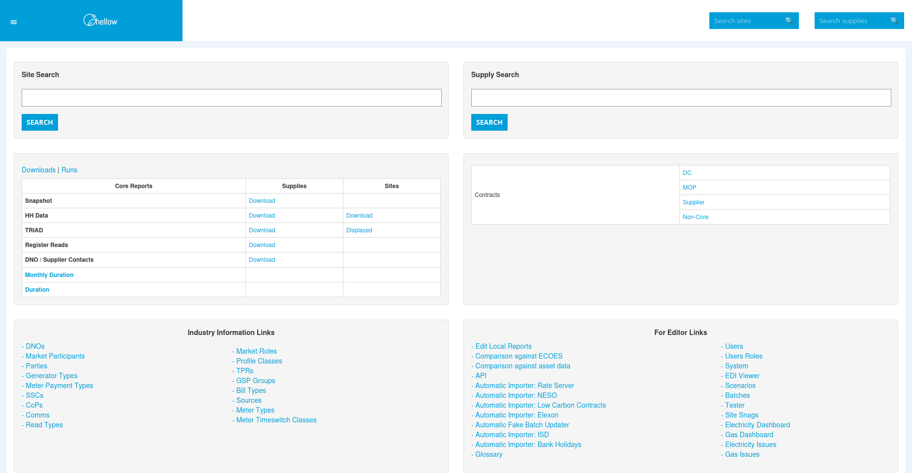
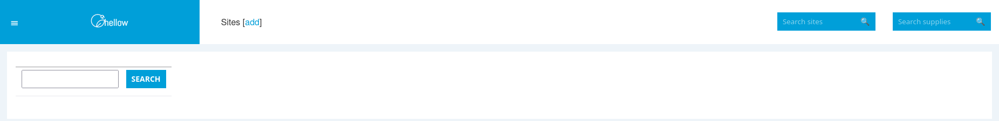
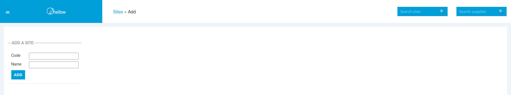
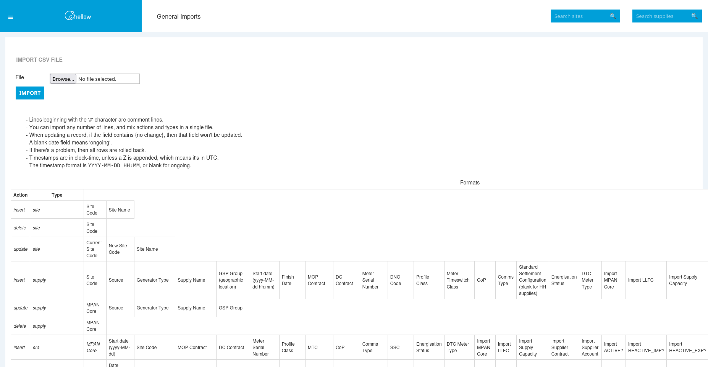

+++
title = "Adding Sites"
date = 2025-11-22T00:00:00Z
template = "feature_page.html"
+++

A site in Chellow represents a location where there are gas and / or electricity supplies. So the
first step in setting up a new instance of Chellow is adding sites.

## Homepage

## Sites

## Add a Site

## Bulk Uploading

In reality your organisation may have thousands of sites, in which case sites can be imported
with a CSV file using the General Importer.

