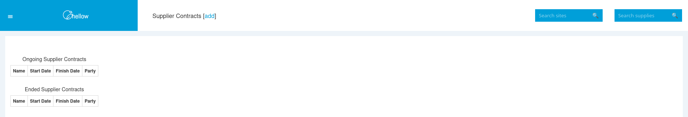

+++
title = "Adding A Supplier Contract"
date = 2025-11-22T00:00:00Z
template = "feature_page.html"
description = "Creating a supplier contract, including a virtual bill"
weight = 2
draft = true
+++

A supplier contract holds the virtual bill script, and is used throughout Chellow. From the
homepage we can go to the supplier contracts page:
 
## Supplier Contracts

## Add a Supplier Contract

## Bulk Uploading

In reality your organisation may have thousands of sites, in which case sites can be imported
with a CSV file using the General Importer.

