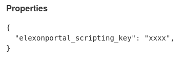
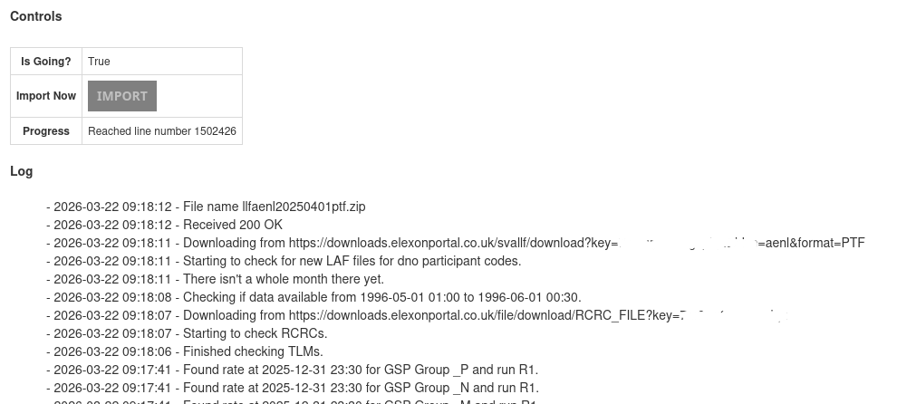

+++
title = "Elexon Importer"
date = 2025-11-22T00:00:00Z
template = "feature_page.html"
description = "Automatic import of Elexon data"
weight = 3
+++

Elexon provides a wealth of industry data essential to creating virtual bills. It's free to
access this data, but you have to create an account on the
[Elexon Portal](https://www.elexonportal.co.uk/) and then copy the
scripting key from the [Elexon Profile Page](https://www.elexonportal.co.uk/profile/basic). 

## Configuration

In Chellow, go to <code>Contracts » Non-Core Contracts » Configuration</code> and enter the key
like this:

## The Importer

Clicking on the <code>Automatic Importer: Elexon Importer</code> link takes you to the page for
importing the data from Elexon. The importer runs once a day automatically by
default, so you should rarely have to attend to it.

## Running An Import

Now that we've configured the importer with our scripting key, click the <code>Import Now</code>
button to start an import. Click the browser <code>refresh</code> button to see the latest progress
in the log:

Make sure it completes successfully.

